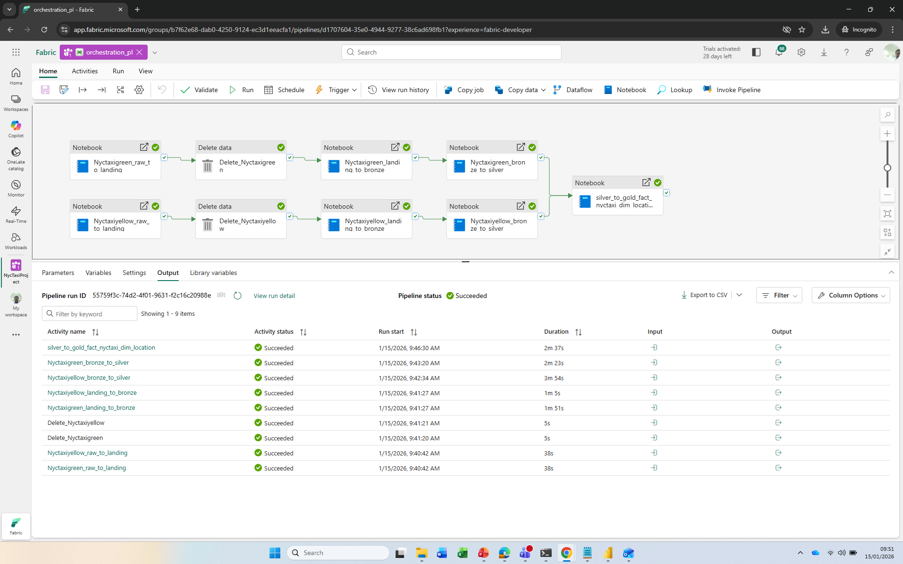
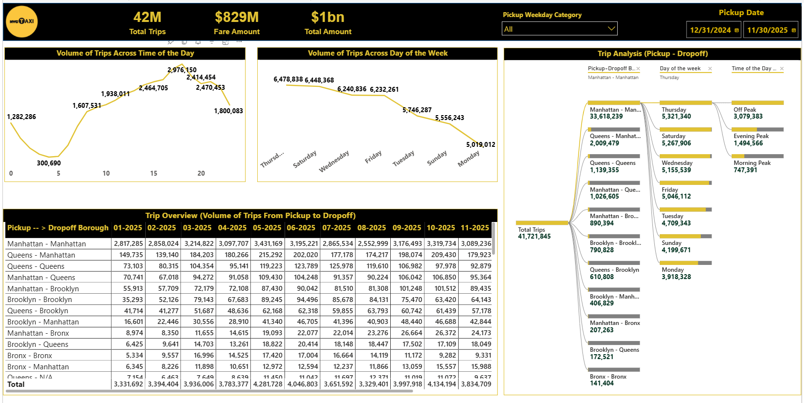
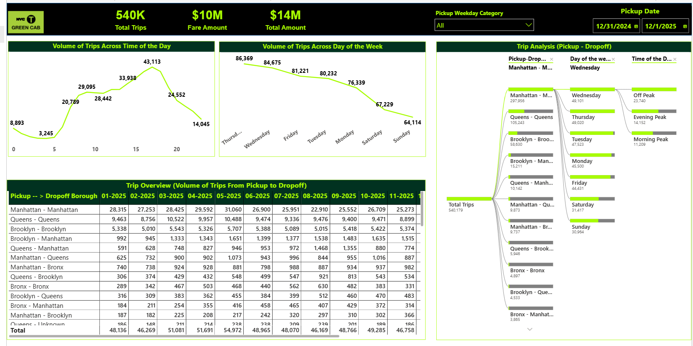

**Microsoft Fabric Data Engineering Project - NYC Taxi Data Integration**
---
**Project Overview:**

This project implements a fully parameterised, end-to-end data engineering solution using **Microsoft Fabric Lakehouse,** designed to integrate and analyse the **Yellow and Green Taxi datasets for 2025.**

The solution follows the **Medallion Architecture (Raw --> Landing --> Bronze --> Silver --> Gold),** implementing **Incremental ingestion, transformation, validation, and modelling** pipelines built with PySpark Notebooks orchestrated through **Fabric Data Pipelines.**

More than **42 million trip records** were processed into a **unified fact table** enriched with temporal and geographic dimensions to reveal demand patterns across NYC boroughs and times of day.
The Gold layer serves as the analytical foundation for two **Power BI reports**, One for Yellow Taxi and one for Green Taxi, providing operational and performance insights such as hourly trip volumes, weekday patterns, borough flows, and seasonal trends.

This project showcase key data engineering proficiencies including **Data Lakehouse design,** **DeltaLake Incremental Merge Logic, Dimensional Modelling, Data Quality Management, and Power BI Integration** within the Microsoft Fabric environment.

---

**Project Objective:**

      - Build a repeatable, parameterised ingestion pipeline
      - Enforce data quality and consistency using PySpark rules
      - integrate the Yellow and Green NYC Taxi datasets into a unified analytical data model following the medallion architecture (Raw --> Landing --> Bronze --> Silver --> Gold).
      - Visualise operational performance

---

**Project Deliverable:**

      - Five Fabric Notebooks integrated into a Data Pipeline
      - Bronze --> Silver transformation with validation flags
      - Fact and Dimension tables in Delta Lake
      - Two Power BI reports with KPI cards and visuals

---

**Tech Stack:**

      - Platform: Microsoft Fabric Lakehouse (Delta Architecture)
      - Pipeline Orchestration: Fabric Data Pipeline
      - Processing: PySpark (Spark Runtime)
      - Storage: OneLake / DeltaLake / Parquet
      - Visualisation: Power BI
      - Languages: SQL & Python
      
---

**Architecture Summary**

The project follows the Medallion Architecture pattern, ensuring clean data progression, high data quality, and scalability.

| Layer                | format used  |          Description                                                    | Key Actions                                                       |
| -------------------- | ------------ | ------------------------------------------------------------------------|-------------------------------------------------------------------|                              
| Raw                  | Parquet      | Original source data exactly as received                                | Data upload from source site                                      |
| Landing              | Parquet      | Staging area for incremental loads using date parameter                 | Add processing_date and store partitioned data                    |
| Bronze               | Delta        | Dataset stored exactly as recieved including parameter (processing_date)| Schema enforcement and consistent formatting                      |
| Silver               | Delta        | Business transformed and enriched data                                  | Data quality checks, lookups, and derived columns                 |
| Gold                 | Delta        | Analytical layer with fact and dimenstion table                         | Unified fact table with dimensional model for analytics reporting |

---

---

**Data Flow Summary**

---

**Step 1: Raw --> Landing**

Source: NYC Yellow and Green Taxi datasets stored in:

      - /Files/Raw/nyctaxiyellow
      - /Files/Raw/nyctaxigreen
      - Added a new column processing_date to track data load batches
      - Data read using PySpark and written to Landing layer with partitioning by processing_date:
      - /Files/Landing/nyctaxiyellow
      - /Files/Landing/nyctaxigreen
      

**Step 2: Landing --> Bronze**

      - Landing data loaded using today_date parameter
      - stored data into Bronze Delta tables
      - nyctaxiyellow_bronze
      - nyctaxigreen_bronze

**Step 3: Bronze --> Silver**

      - Applied basic schema checks, transformation and standardisation
      - ntroduced data validation and business rules
      - Dropped null rows in key columns
      - Derived trip duration, pickup time bucket, day of the week, etc
      - Created business and natural keys using SHA2 hashing
      - Enhanced with mappable dimensions
      - Stored results in Silver Delta tables:
      - yellowtaxi_silver
      - greentaxi_silver

  **Step 4: Silver --> Gold**

      - Combined yellow and green silver tables into a unified Fact Trip Table
      - Create dimension table dim_location from taxi zone lookup
      - Created a surrogate key in dim_location using Window functions
      - Joined dim_location to the combination of (yellow and green silver) to replace each of the pickup_location_id and dropoff_location_id in (yellow and silver combination) with newly created surrogate key in dim_location
      - Created a Fact Table (fact_nyc_taxi) with full upsert (merge) logic to support incremental updates

---

**Key Functional Logic**

---

**Data Quality**

      - Invalid or missing trips flagged before load
      - Null-critical fields (Vendor, pickup_datetime, dropoff_datetime) removed
      - Logical check: Pickup_datetime must not be later than dropoff_datetime

**Data Enrichement**

      - Derived additional columns for deeper analytics
      - trip duration minutes
      - pickup day of the week
      - pickup time bucket (morning peak, evening peak, off peak)
      - pickup week day type (weekday/weekend)

**Surrogate and Natural Keys**

      - trip_business_key: composed of location ids, vendor, pickup_datetime and dropoff_datetime
      - trip_natural_key - SHA2 hash of business key for uniqueness across datasets

---

**Fact and Dimension Design**

---

**Dimension Table - dim_location**

| Column               | Description                                      |
| -------------------- | -------------------------------------------------|                            
| location_sk          | Surrogate key: derived using (window function)   | 
| location_id          | Original location id                             | 
| borough              | NYC borough                                      |                                    
| zone                 | NYC Taxi zone                                    | 
| service_zone         | NYC service area of the trip                     | 

**Fact Table - fact_nyc_taxi**

| Column                                         | Description                                                                                    |
| -------------------------------------          |------------------------------------------------------------------------------------------------|                            
| vendor_id, vendor_name                         | Taxi vendor                                                                                    | 
| pickup_datetime, dropoff_datetime              | Trip timestamps                                                                                | 
| trip_distance                                  | Distance travelled                                                                             |                                    
| fare_amount, total_amount                      | Cost metrics                                                                                   | 
| pickup_location_sk, dropoff_location_sk        | Replace inital pickup_location and dropoff_location_id with the location_sk in dim_location    | 
| trip_duration_minutes                          | compute travel duration                                                                        |
| pickup_time_bucket                             | Categorised travel time range                                                                  |
| trip_natural_key                               | Unique hash key for row identification                                                         |

---

**Pipeline Orchestration**

Dataset for year 2025 ingested using **Mircosoft Fabric Pipeline**

      - Each notebook (Raw --> Landing --> Bronze --> Silver --> Gold) is parameterised with processed_date and today_date
      - The pipeline automates incremental ingestion, transformation, and loading.
      - Applied to full 2025 dataset (42.5 million rows) with manual triggers applied.

---

---

**Performance and Monitoring**

Implemented **Delta Table History** to monitor update, insert, and delete metrics.

      - numTargetRowsinserted
      - numTargetRowsupdated
      - numTargetRowsdeleted
      - Display total impacted rows after each merge
      - successfully loaded 42.5 million records with efficient merge operations.

---

**Pwer BI Reporting and Insights**

Two Power BI reports were created using the Gold Layer data model. Each report explores the performance and behaviour of the Yellow and Green taxis respectively during the year 2025.

      - Report 1 - Yellow Taxi 2025 performance summary
      - Report 2 - Green Taxi 2025 performance summary

**Objectives**

      - Develop overall taxi performance for 2025
      - Identify the most frequent borughs for pickups and dropoffs
      - Highlight the busiest routes and peak periods for each taxi type

**Report Layout and Design**

**Top Level KPI Cards:**

       - Total trips: total ride count for the selected taxi type
       - Total fare amount: overall fare revenue generated
       - Total Amount - total fare plus surcharges and tips

**Main visuals:**

       - Line chart: volume of trips across time of day in 2025. Shows hourly demand trend
       - Line chart: volume of trips across days of the week. Highlights weekday vs weeekend trends
       - Matrix visual: overview of trips across month of the year 2025
       - Decomposition Tree: evaluates total trips by multiple factors, pickup borugh --> dropoff borough, day of week, tome of day bucket. Enables interactive exploration of busiest routes and periods

**Insights Discovered**

**Trip Volume by Hour of Day**

       - Trip activity begins to rise sharply after 08:00 in weekdays and the trend continues on an upward curve, peaking around 18:00
       - After the evening peak(18:00), trip counts gradually falls in weekdays
       - The same trends can also be seen with weekend trip

**Trip Activity by Day of Week**

       - Monday recorded the lowest number of trips across the week.
       - Wednesday, Thursday, Friday and Saturday exhibited similar trip volumes, averaging around 6.3 million trips each
       - This suggested consistent demand mid-to-late week, with a noticeable slowdown at the start of the week

**Pickup-Dropoff-Borough trends**

       - Manhattan-to-Manhattan journeys dominated, with approximately 34 million trips out of 42.5 million total
       - This equates to nearly 85% of all recorded trips in 2025, a strong indication that the majority of journeys occured within borough boundaries rather than inter-borough routes.
       - Given Manhattan's business and tourism activity, this dominance is both significant and expected.

**Peak vs off-peak**

       - The majority of trips occurred during off-peak hours, demonstrating high availability and flexible customer demand outside traditional rush times.
       - A considerable proportion of journeys also took place duting the evening peaks, alignging with after work and leisure activities.

---

 Yellow NYC taxi report                      |                        
  :-----------------------------------------:|
                  |        

       

 Green NYC taxi report                    |                    
  :--------------------------------------:|
                 |

      
